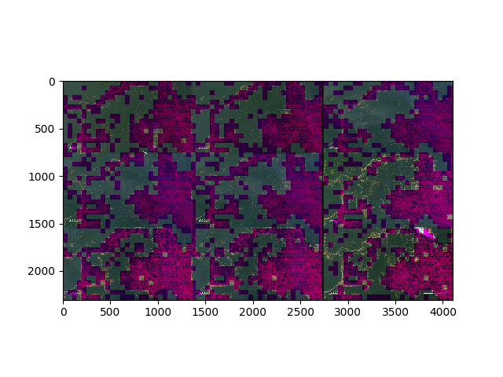

# Deforestation

That time I used [KNN](https://en.wikipedia.org/wiki/K-nearest_neighbors_algorithm) to classify deforested areas for my machine learning class.



## About

This project was developed as an assignment for a machine learning class, where we were given a pictures from the Amazon forest and we should write a machine learning algorithm to identify possibles deforested areas, including farming areas. 

I then gather some training data, generated a histogram for every image and analysed the final image with a simple KNN (k=7) I wrote.

I was very happy with the results I got given the little code I wrote.

## How to run

```
python classify.py img/final_image.png
```
